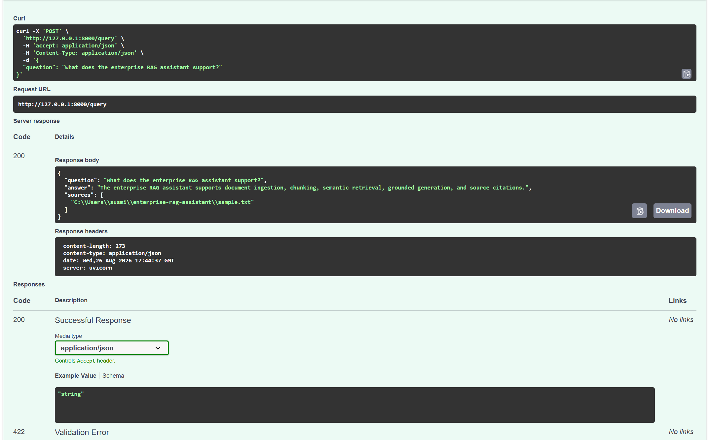

# Enterprise RAG Assistant

A local Retrieval-Augmented Generation (RAG) application for enterprise document question answering.

The project ingests documents, splits them into chunks, generates local embeddings, stores them in FAISS, retrieves relevant context, and generates grounded answers using a local Ollama model.

## Features

- Document ingestion for PDF and TXT files
- Recursive text chunking
- Local embedding generation with `nomic-embed-text`
- FAISS vector search
- Semantic retrieval
- Grounded answer generation
- Source citation in responses
- FastAPI backend
- Swagger API documentation
- Fully local inference with Ollama
- No paid API required

## Tech Stack

- Python
- FastAPI
- LangChain
- Ollama
- Llama 3.2
- `nomic-embed-text`
- FAISS
- Pydantic
- PyPDF
- Pytest

## Architecture

```text
Document
   ↓
Document Loader
   ↓
Chunking
   ↓
Ollama Embeddings
   ↓
FAISS Vector Store
   ↓
Semantic Retrieval
   ↓
Context Assembly
   ↓
Llama 3.2
   ↓
Grounded Answer + Source
```

## Project Structure

```text
enterprise-rag-assistant/
│
├── app/
│   ├── main.py
│   ├── ingestion.py
│   ├── vector_store.py
│   ├── rag_pipeline.py
│   └── config.py
│
├── .env.example
├── .gitignore
├── requirements.txt
├── LICENSE
└── README.md
```

## Local Setup

### 1. Clone the repository

```bash
git clone https://github.com/Susmitha165/enterprise-rag-assistant.git
cd enterprise-rag-assistant
```

### 2. Create a virtual environment

```bash
python -m venv .venv
```

On Windows:

```bash
.venv\Scripts\activate
```

### 3. Install dependencies

```bash
pip install -r requirements.txt
```

### 4. Install Ollama models

Install Ollama, then pull the required local models:

```bash
ollama pull llama3.2
ollama pull nomic-embed-text
```

### 5. Start the API

```bash
uvicorn app.main:app
```

Open Swagger UI:

```text
http://127.0.0.1:8000/docs
```

## Example Workflow

### 1. Ingest a document

Use the following endpoint:

```text
POST /ingest
```

Example request:

```json
{
  "file_path": "C:\\path\\to\\your\\document.txt"
}
```

Example response:

```json
{
  "status": "success",
  "chunks_created": 1
}
```

### 2. Ask a question

Use:

```text
POST /query
```

Example request:

```json
{
  "question": "What does the document say?"
}
```

Example response:

```json
{
  "question": "What does the document say?",
  "answer": "The answer is generated from the retrieved document context.",
  "sources": [
    "document.txt"
  ]
}
```

## API Endpoints

| Method | Endpoint | Description |
|---|---|---|
| GET | `/` | Service status |
| GET | `/health` | Health check |
| POST | `/ingest` | Load, chunk, embed, and index a document |
| POST | `/query` | Retrieve relevant context and generate an answer |

## How It Works

The application follows a simple RAG workflow:

1. A PDF or TXT document is loaded.
2. The document is divided into smaller chunks.
3. `nomic-embed-text` generates embeddings locally through Ollama.
4. FAISS stores the document vectors.
5. A user question is converted into an embedding.
6. FAISS retrieves the most relevant document chunks.
7. Retrieved context is passed to Llama 3.2.
8. The model generates an answer using only the retrieved context.
9. The API returns the generated answer and source information.

## Example

Sample document:

```text
Our enterprise RAG assistant supports document ingestion, chunking,
semantic retrieval, grounded generation, and source citations.
```

Question:

```text
What does the enterprise RAG assistant support?
```

Example result:

```text
The enterprise RAG assistant supports document ingestion, chunking,
semantic retrieval, grounded generation, and source citations.
```

## Demo

Successful end-to-end RAG query using the local Ollama + FAISS pipeline:



## Tests

Run the test suite with:

```bash
python -m pytest
```

Current result:

```text
2 passed
```

## Current Status

The core RAG workflow is implemented and working locally.

Implemented functionality:

- PDF and TXT document loading
- Document chunking
- Local embeddings
- FAISS vector indexing
- Semantic retrieval
- Local LLM generation
- Grounded question answering
- Source attribution
- FastAPI REST API
- Swagger documentation
- Ollama-based local inference

## Why Local Models?

This project uses Ollama so the complete RAG workflow can run locally without depending on paid external LLM APIs.

Benefits include:

- No API usage cost
- No external API key required
- Local document processing
- Easy development and experimentation
- Reduced dependency on third-party model APIs

## Planned Improvements

Future improvements may include:

- Metadata filtering
- Hybrid BM25 + semantic retrieval
- Reranking
- Automated RAG evaluation
- RAGAS evaluation metrics
- Guardrails
- PII detection and redaction
- Docker support
- Automated testing
- CI/CD with GitHub Actions
- Production monitoring and observability

## License

This project is licensed under the MIT License.
